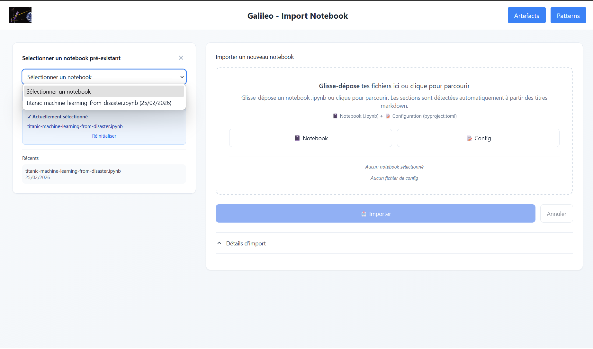
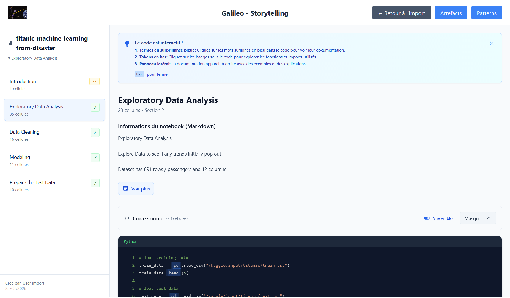
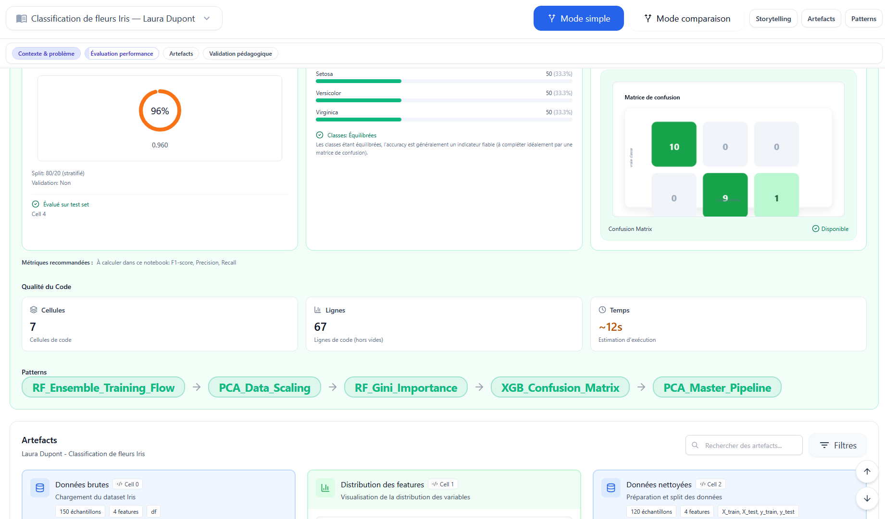
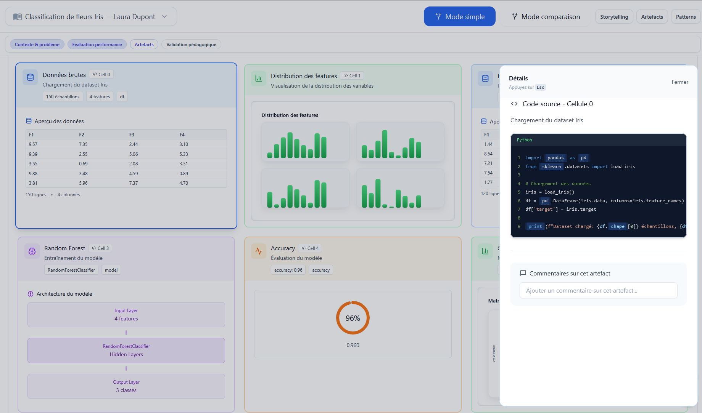
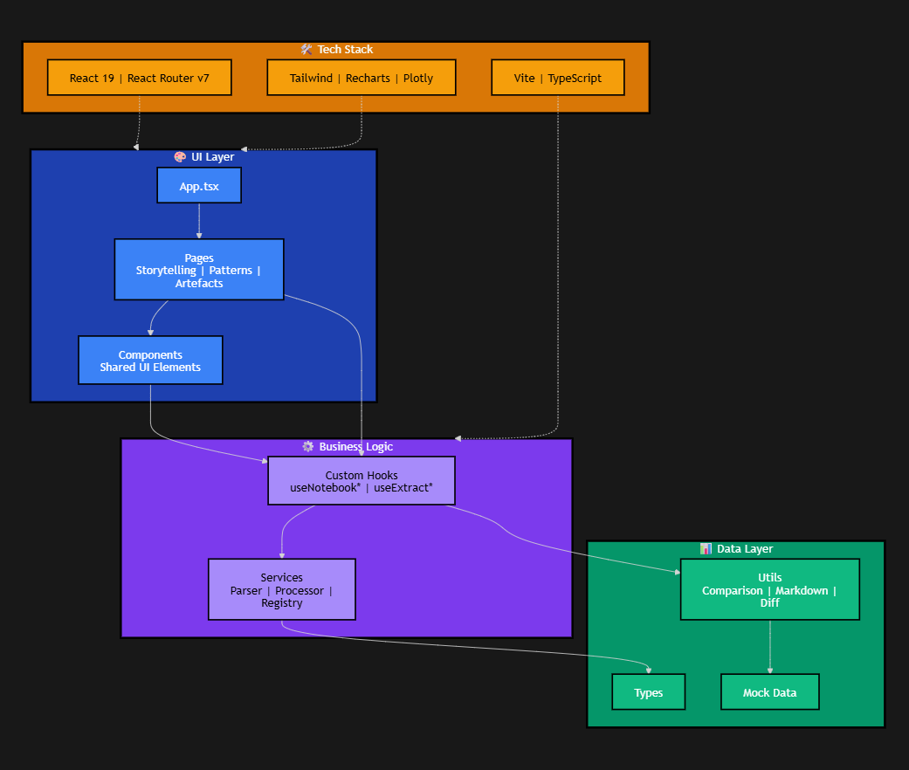

# 12) Appendices

This chapter lists supporting material that complements the report.

The source code is available in this Git repository.

## 12.0 Key directories

- [src/](../../src/): front-end application (React + TypeScript)
- [public/](../../public/): public assets and examples
- [src/stories/](../../src/stories/): Storybook component library

Appendix assets (screenshots, diagrams) are stored under:

- [docs/rapport/assets/](assets/)

## 12.1 Interface screenshots

Screenshots used for the final report are stored under [docs/rapport/assets/screenshots/](assets/screenshots/).

### 12.1.1 Notebook import & Storytelling

### 12.1.2 Artefacts (single notebook)

### 12.1.3 Artefacts (comparison)

### 12.1.4 Patterns

## 12.2 Source code

- Repository: https://github.com/colombus-dev/galileo

## 12.3 Planning

### Meeting schedule

- Regular phase: Friday 10:00 — planning/progress meeting
- Full-time phase: Tuesday 15:00 and Friday 10:00 — planning/progress meetings

### Workload assumption

- Regular phase: ~5 hours/week/student
- Full-time phase (4 weeks): ~5 hours/day/student

## 12.4 Simplified architecture schema

The schema below summarizes the main client-side pipeline (import → parsing → local persistence → views). It is intentionally simplified for report readability.

## 12.5 Other repository documents

Other useful documents :

- Project setup and usage: repository root [README.md](../../README.md)
- Containerization: [Dockerfile](../../Dockerfile), [docker-compose.yml](../../docker-compose.yml)
- Storybook static build: [storybook-static/](../../storybook-static/)
- Mock assets used in the UI: [public/mock/](../../public/mock/)

## 12.6 External deliverables

- Full State Of The Art document: https://drive.google.com/file/d/12i1iuh2p28A-RX2QP793nC0-qnn7z7wZ/view?usp=sharing
- Analysis of the original platform : https://drive.google.com/file/d/1VpChHFrOr2Z2MIMfxJ4_3wEJu2AbDdy9/view?usp=drive_link
- Presentation video: https://drive.google.com/file/d/1KOnfb25bwhPWvO8oJxv8nz0CJIGNL6yE/view?usp=sharing
- Questionnaire: https://forms.gle/9s6XVnL5khdUY3R99

